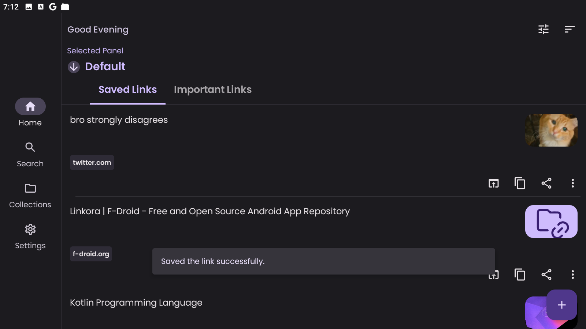

# Linkora

Save, organize, and sync your links between Android and desktop. Whether you're quickly bookmarking
something or managing a structured folder hierarchy with tags, Linkora handles it all with optional
self-hosted sync.

A browser extension is available for saving web links directly to Linkora via sync server.

[sync server](https://github.com/LinkoraApp/sync-server) | [Extension repo](https://github.com/LinkoraApp/browser-extension)

## Download

 

## Features

- **Organize links** with unlimited folders and subfolders, tags, and easy copying/moving between
  folders
- **Multiple view layouts** (Grid, List, Staggered views) with AMOLED theme support
- **Highlight important links** and archive old ones for clean organization
- **Customize link names** and auto-recognize images/titles from web pages
- **Share from other apps** (Android) and add folders to **_Panels_** for quick access
- **Sort, search, import/export** data in JSON and HTML formats with auto-backups
- **Keep your links in sync** across devices with
  optional [self-hostable server](https://github.com/LinkoraApp/sync-server)

[How sync works](https://sakethpathike.github.io/blog/synchronization-in-linkora) · [Server setup instructions](docs/ServerConnectionSetup.md) 

## Screenshots

### Mobile

|                    |                    |                    |                    |
|--------------------|--------------------|--------------------|--------------------|
|  |  |  |  |
|  |  |  |  |

### Desktop

|                    |                    |
|--------------------|--------------------|
|  |  |
|  |  |

## Built with

- Kotlin Multiplatform + Compose Multiplatform + Material 3
- SQLite with Room (local storage) + Ktor (networking)
- Coroutines and Flows for async operations
- jsoup for HTML parsing and metadata extraction
- Coil for image loading

### Localization

Linkora supports multiple languages with remote strings that can be updated without requiring an app
update. If you'd like to help translate Linkora into your language or improve existing translations,
please go through the [localization server](https://github.com/LinkoraApp/localization-server)'s
README to learn more about how localization is handled and how you can contribute.

## Support

**Star the repo** if you find Linkora useful

## Community

---

**Contributing?** See the [contributing guide](CONTRIBUTING.md)

**License:** MIT
