# Linkora

Save, organize, and sync your links between Android and desktop. Whether you're bookmarking something quickly or managing a structured folder hierarchy, Linkora handles it all with optional self-hosted sync.

Powerful link organization with a simple, clean interface.

## Download

 

## Features
- **Organize links** with unlimited folders and subfolders and easily copy and move links between folders
- **Multiple view layouts** (Grid, List, Staggered views) with AMOLED theme support
- **Highlight important links** and archive old ones for clean organization
- **Customize link names** and auto-recognize images/titles from web pages
- **Share from other apps** (Android) and add folders to **_Panels_** for quick access
- **Sort, search, import/export** data in JSON and HTML formats with auto-backups
- **Keep your links in sync** across devices with optional [self-hostable server](https://github.com/LinkoraApp/sync-server)

[Server setup instructions](docs/ServerConnectionSetup.md) · [How sync works](https://sakethpathike.github.io/blog/synchronization-in-linkora)

## Screenshots

### Desktop

|                    |                    |
|--------------------|--------------------|
| 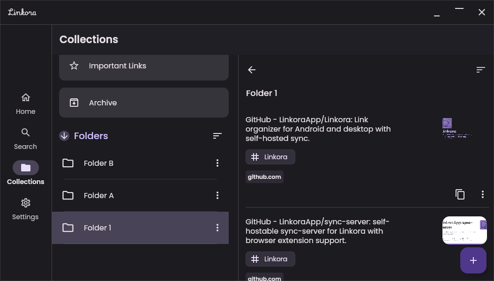 | 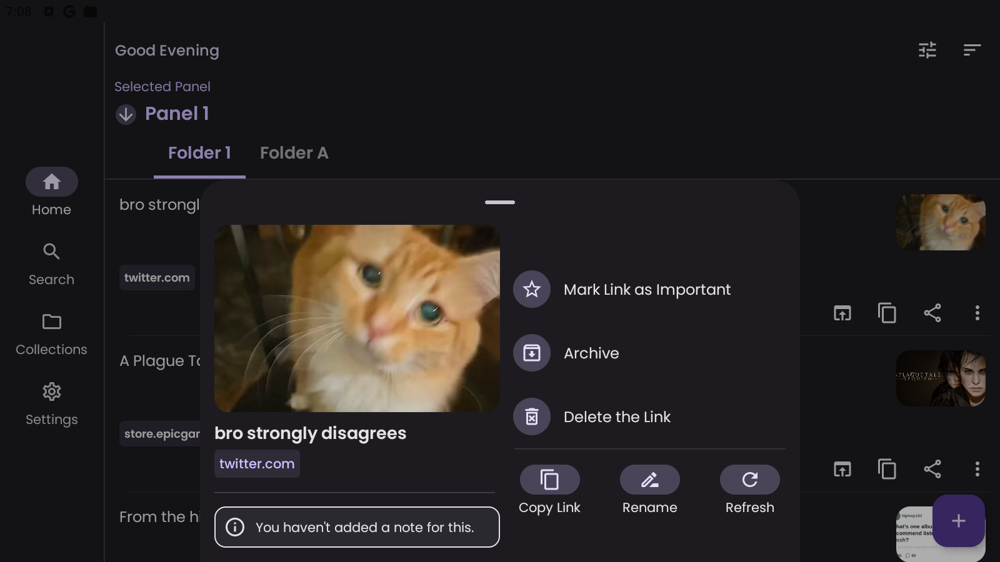 |
| 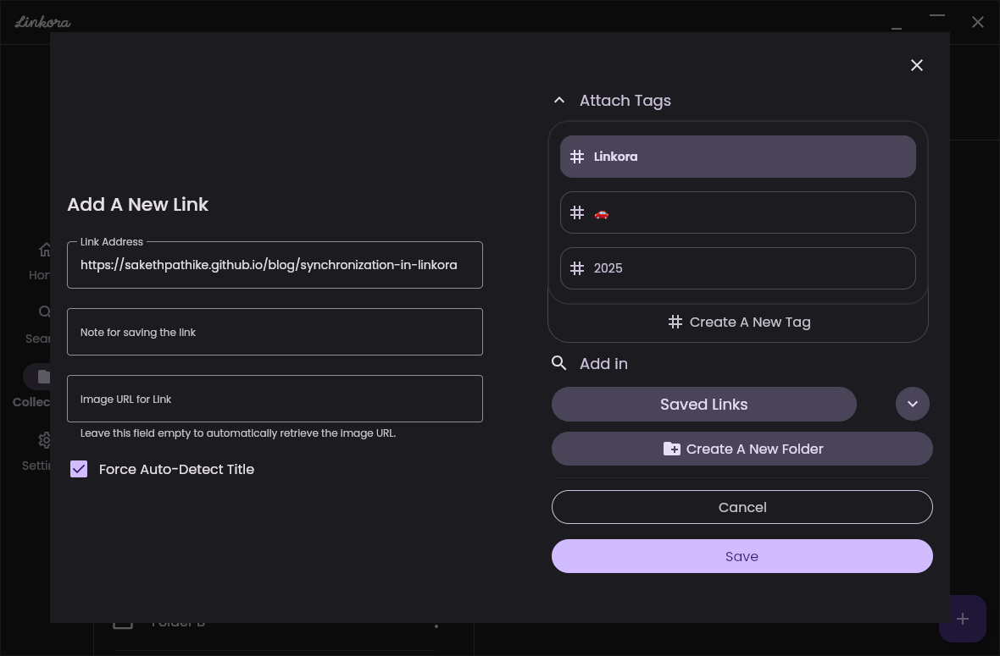 | 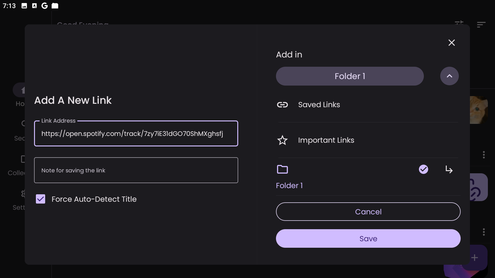 |

### Mobile

|                    |                    |                    |                    |
|--------------------|--------------------|--------------------|--------------------|
| 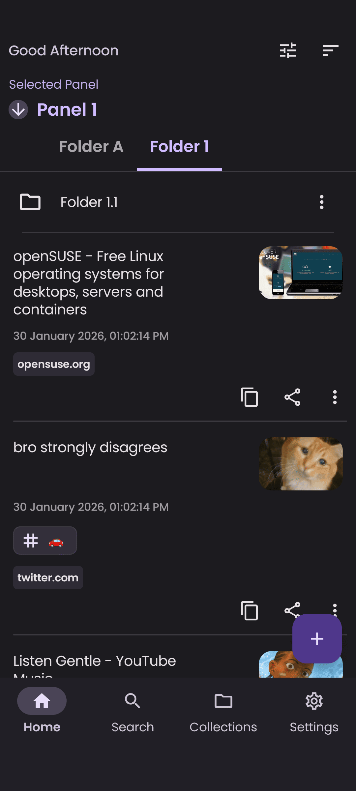 | 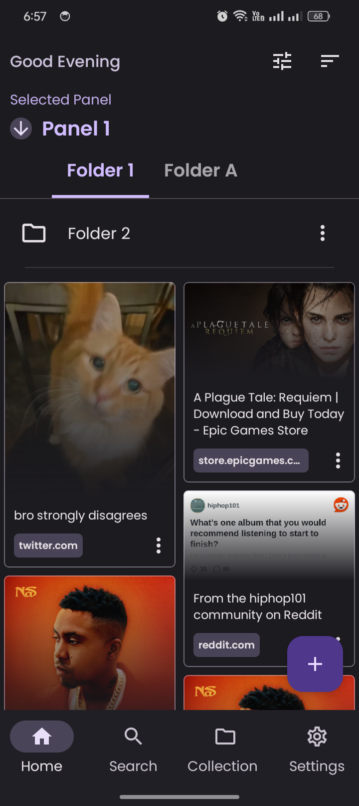 | 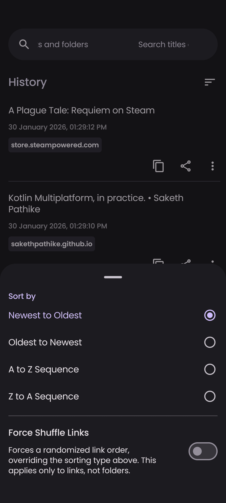 | 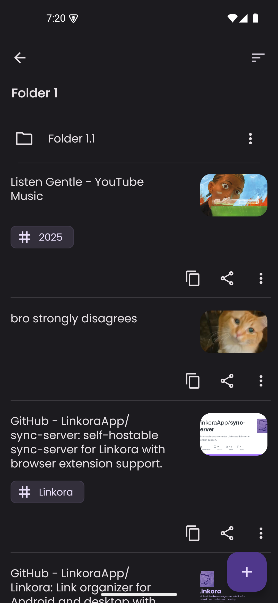 |
| 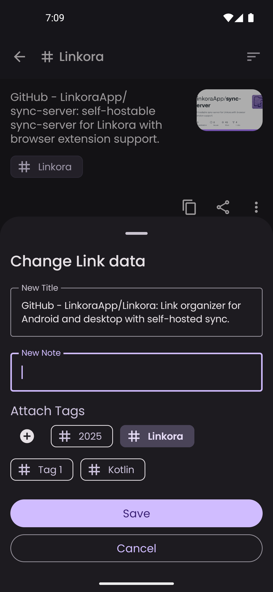 | 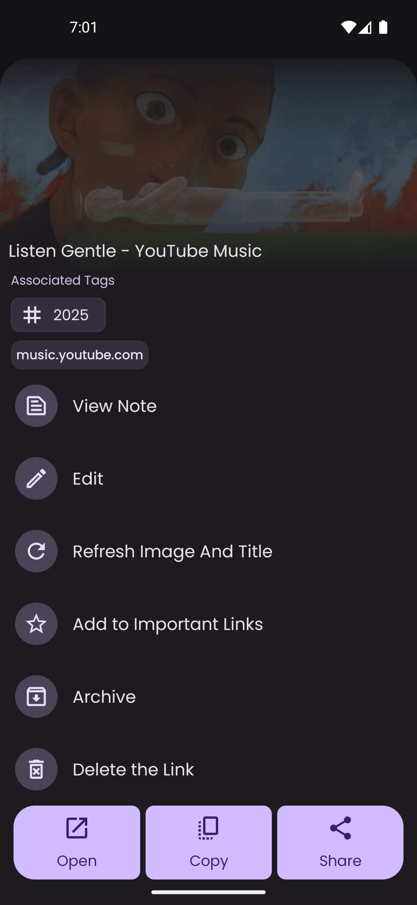 | 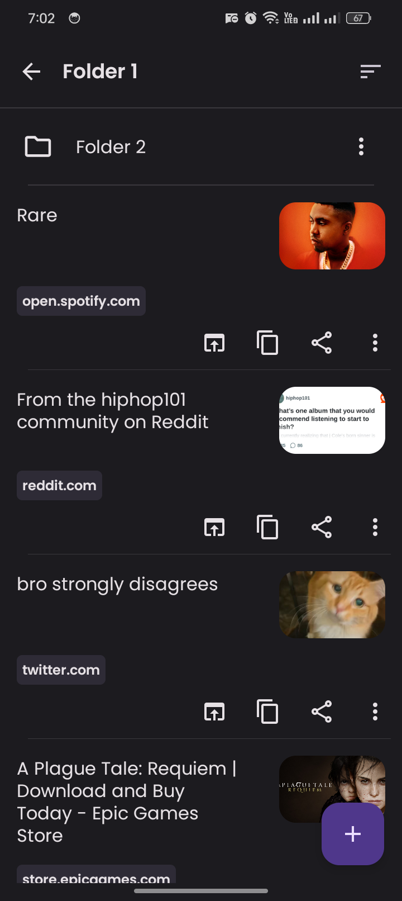 | 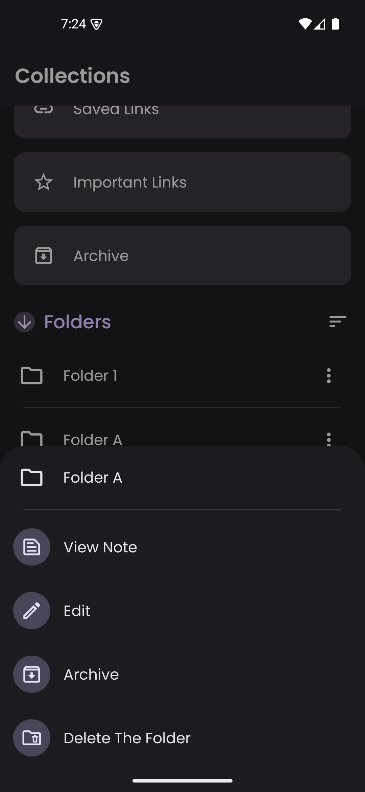 |

### Sharing from other apps

<video src="https://github.com/user-attachments/assets/65fdbdb9-83da-4d83-9dd9-2fa3e3504bc0"></video>

## Built with

- Kotlin Multiplatform + Compose Multiplatform + Material 3
- SQLite with Room (local storage) + Ktor (networking)
- Coroutines and Flows for async operations
- jsoup for HTML parsing and metadata extraction
- Coil for image loading

## Support

Linkora has been solo-developed for 2+ years with over 1500 hours invested.  
If you find it useful, consider supporting further development:

## Community

---

**Contributing?** See the [contributing guide](CONTRIBUTING.md) · **License:** MIT